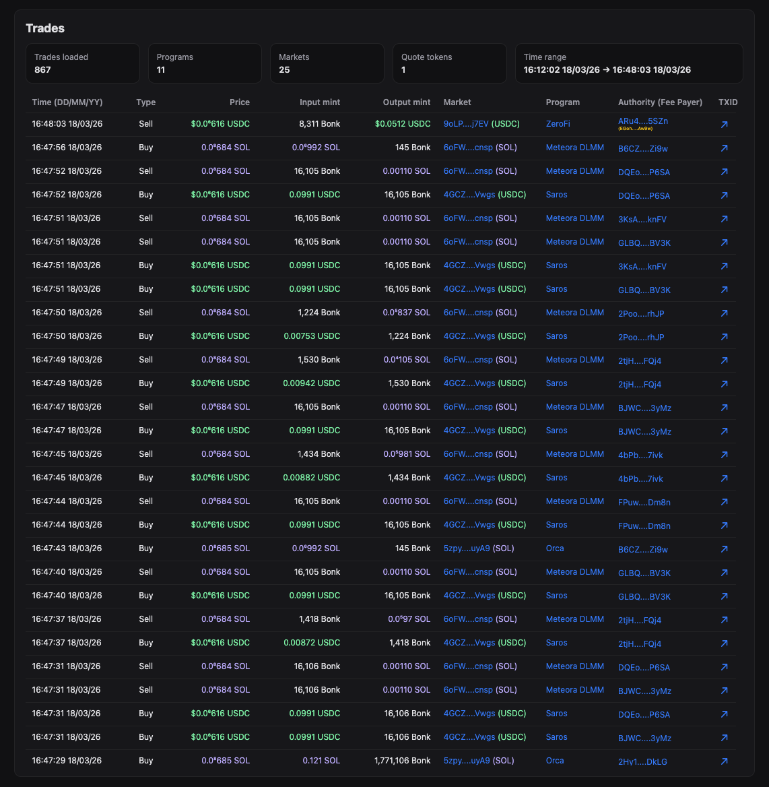
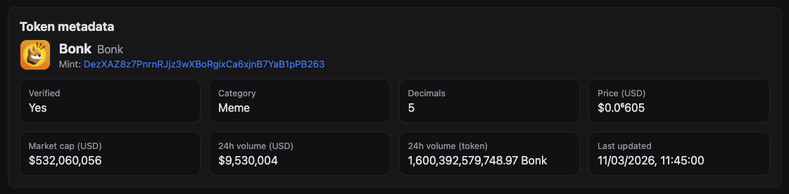
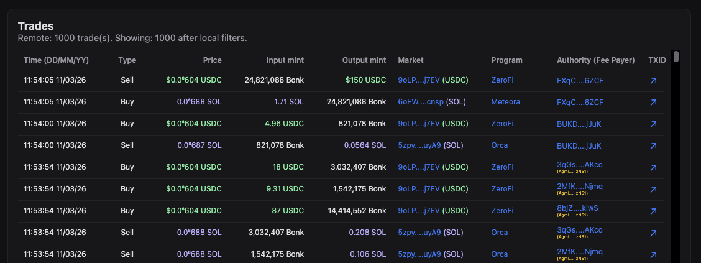
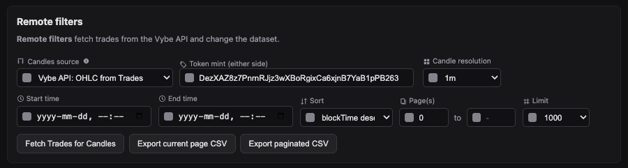
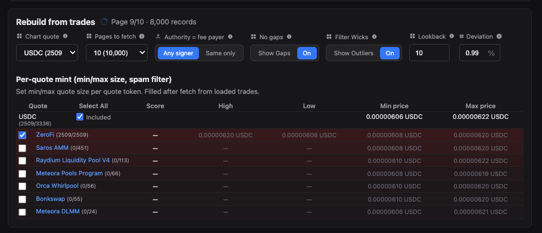

# Solana OHLC Candlestick Data API

This repository demonstrates how to use the Vybe Solana OHLC candlestick data API to fetch, display, and export Open, High, Low, Close (OHLC) candlestick data for any Token-2022 or SPL token. It includes a production-ready Node.js backend and a modern frontend that show how to integrate Vybe’s token candles, market candles, and trades endpoints to explore candlestick charts from vetted markets, rebuild OHLC from trade history, or fetch by market address, with CSV export for downstream analysis.

Try the live demo: https://solana-ohlc-candlestick-data-api.vybenetwork.com

Use this project as a reference implementation or starter kit for building Solana price charting UIs, backtesting pipelines, and on-chain candlestick data products powered by Vybe’s high-performance Solana OHLC API.


<p align="center">
  
  
</p>

---

**[Try the LIVE demo →](https://docs.vybenetwork.com/docs/fetch-ohlc-candles)**

**[Get your free Vybe API key →](https://vybenetwork.com/pricing)**  

**[Vybe OHLC candles docs →](https://docs.vybenetwork.com/docs/fetch-ohlc-candles)**

---

## Prerequisites

- **Node.js** ≥ 20 (LTS recommended)
- **npm** ≥ 10 (or equivalent)

## Quick Start

Get from clone to running app in a few commands:

```bash
git clone https://github.com/vybenetwork/solana-ohlc-candlestick-data-api.git
cd solana-ohlc-candlestick-data-api
npm install
cp .env.example .env
# Edit .env and set VYBE_API_KEY=your_api_key_here
npm start
```

Then open **http://localhost:3000**, enter a token mint (or market address when using OHLC from Market), and click **Fetch Candles** or **Fetch Trades for Candles**.

## Environment Variables

| Variable          | Required | Description                                                                 | Example                                   |
|-------------------|----------|-----------------------------------------------------------------------------|-------------------------------------------|
| `VYBE_API_KEY`    | Yes      | Vybe API key used for all Vybe requests                                     | `your_api_key_here`                       |
| `SOLANA_RPC_URL`  | No       | RPC endpoint for Metaplex symbol lookup (token-symbol fallback for quotes) | `https://api.mainnet-beta.solana.com`    |
| `PORT`            | No       | HTTP server port                                                            | `3000`                                    |
| `TUNNEL`          | No       | Set to `1` to run behind a Cloudflare Tunnel                               | `1`                                       |

Get your API key at `https://vybenetwork.com/pricing`.

---

## What This Repo Provides

- **OHLC and trades endpoint proxy**
  - Express server that proxies Vybe:
    - `GET /v4/tokens/{mintAddress}/candles` (token OHLC from vetted markets)
    - `GET /v4/markets/{marketAddress}/candles` (OHLC for a single market)
    - `GET /v4/trades`
    - `GET /v4/programs/labeled-program-accounts`
    - `GET /v4/tokens/{mintAddress}` (token metadata for the UI header)
- **OHLC candlestick web UI**
  - Single-page GUI (no frameworks) built from `src/frontend/app.ts` into `public/app.js`.
  - Lets you view candlestick charts and trade flows for a token, across three data sources: vetted token OHLC, OHLC rebuilt from trades, or OHLC by market address.
- **Three candle data sources**
  - **Vybe API: OHLC Vetted Markets** — token candles aggregated from vetted USDC/USDT/PYUSD/wSOL markets.
  - **Vybe API: OHLC from Trades** — fetch trades then rebuild OHLC client-side with configurable resolution, Filter Wicks, and per-quote/market exclusions.
  - **Vybe API: OHLC from Market** — OHLC for a single market address (default e.g. `6oFWm7KPLfxnwMb3z5xwBoXNSPP3JJyirAPqPSiVcnsp`).
- **Local filters (no refetch)**
  - Search, type filters, authority=fee payer, and substring filters (`market contains`, `program contains`, `signature contains`, `authority contains`, `fee payer contains`).
  - **Filter Wicks** — trim outlier wicks by lookback and deviation % (only trades beyond recent range).
  - Per-quote mint and per-market exclusions for rebuild-from-trades mode.
- **Per-quote / per-market table**
  - Dynamically generated table of quote mints and markets with included/excluded status, program labels, and trade counts.
- **CSV export**
  - Export **current page** of OHLC (chart data) as CSV.
  - Export **paginated** OHLC (all pages up to configurable max) with columns: time, time_iso, open, high, low, close, volume.

All of this uses Vybe’s production OHLC and trade data across Pump.fun, Raydium, Orca, Meteora, and other Solana DEXes.

---

### Solana API docs for these endpoints

- **Token OHLC candles (`GET /v4/tokens/{mintAddress}/candles`)**:
  - [https://docs.vybenetwork.com/docs/fetch-ohlc-candles](https://docs.vybenetwork.com/docs/fetch-ohlc-candles)
- **Market OHLC (`GET /v4/markets/{marketAddress}/candles`)**:
  - [https://docs.vybenetwork.com/docs/fetch-markets-pools](https://docs.vybenetwork.com/docs/fetch-markets-pools)
- **Historical Trades (`GET /v4/trades`)**:
  - [https://docs.vybenetwork.com/reference/get_trade_data_program_v4](https://docs.vybenetwork.com/reference/get_trade_data_program_v4)
- **Token details (`GET /v4/tokens/{mintAddress}`)**:
  - [https://docs.vybenetwork.com/reference/get_token_details_v4](https://docs.vybenetwork.com/reference/get_token_details_v4)
- **Labeled programs (`GET /v4/programs/labeled-program-accounts`)**:
  - [https://docs.vybenetwork.com/reference/get_known_program_accounts_v4](https://docs.vybenetwork.com/reference/get_known_program_accounts_v4)

---

## Why OHLC / Candlestick Data Matters

OHLC candlestick data is critical for:

- **Charting and UX**: show clean price history with open, high, low, close and volume without scraping or building your own aggregator.
- **Backtesting and strategy**: use vetted-market OHLC or rebuilt-from-trades OHLC for signals and execution analysis.
- **Spam and wick filtering**: when rebuilding from trades, use Filter Wicks (lookback + deviation) and per-quote/market exclusions to remove noise and outlier wicks.
- **Flow and venue analysis**: see which programs and markets dominate flow; switch between token-level OHLC, single-market OHLC, and trade-rebuilt OHLC.

This repo shows how to build a **practical candlestick explorer** on top of Vybe’s token candles, market candles, and trades endpoints.

---

## Frontend Overview (OHLC Candlestick UI)

The OHLC candlestick UI is implemented in `src/frontend/app.ts` and compiled to `public/app.js` via `npm start` (which runs `npm run build:frontend` first).

### Sections

- **Token metadata header**
  - Shows symbol, name, mint, decimals, price, market cap, 24h volume where available (from `GET /api/tokens/:mint`).
  - Falls back to Metaplex/`/api/token-symbol/:mint` when token details fail.



- **Price candlestick chart**
  - LightweightCharts candlestick chart with overlay (symbol, name, last candle OHLC, volume).
  - Data source select: Vybe API OHLC Vetted Markets, OHLC from Trades, or OHLC from Market. Resolution (1m–1mo), optional No gaps (eliminate close-to-open gaps). Chart refreshes when quote currency, resolution, or filters change.

- **Trades summary**
  - Built from the latest fetched trades (no extra Vybe calls):
    - **Top programs**: counts trades by `programAddress` with labels from well-known map and Vybe `GET /v4/programs/labeled-program-accounts`.
    - **Top markets**: counts by `marketAddress` with Solscan link, pair, and trade count.
    - **Top quote mints**: counts by `quoteMintAddress` (using symbol lookup and fallbacks).



- **Trades table**
  - One row per trade from `/api/trades`:
    - Timestamp (from `blockTime`), price, base size, quote size.
    - Program, market, base/quote mints, authority, fee payer, signature.
    - Links to Solscan for account and transaction inspection.
  - Supports pagination via limit, pageFrom, and pages-to-fetch controls.

- **Rebuild from trades panel**
  - Visible when candle source is “OHLC from Trades”. Chart quote dropdown, pages to fetch, Authority = fee payer, No gaps, **Filter Wicks** (On/Show Outliers, lookback trades, deviation %), and per-quote/per-market table with include/exclude and program labels.

- **Per-quote / per-market table**
  - Built from the currently loaded, locally filtered trades when using OHLC from Trades. One row per quote mint or market with Quote/Market, Status (Included/Excluded), program label, counts, and checkbox to exclude. Chart refreshes when quote or filters change.

### Value formatting rules (per-quote table)

- **≥ 100**: show with **0 decimals**.
- **1–100**: show with **2 decimals**.
- **< 1**:
  - Up to 4+ decimals, depending on leading zeros after `0.`.
  - The UI keeps at most the first two non-zero significant digits after leading zeros.
- Spinner arrows adjust the value by the smallest meaningful increment for the current magnitude.

---

## Filters & Workflow

### Remote filters (Vybe query params)



The top of the UI controls the request sent to the API:

- **Candle source**
  - **Vybe API: OHLC Vetted Markets** — uses token mint; requests `GET /api/tokens/:mint/candles`.
  - **Vybe API: OHLC from Trades** — uses token mint; requests `GET /api/trades` (with optional `marketAddress` when “OHLC from Market” is not selected), then rebuilds OHLC client-side.
  - **Vybe API: OHLC from Market** — uses market address input; requests `GET /api/markets/:marketAddress/candles`; trades fetch uses `marketAddress` param.
- **Token mint / Market address**
  - Single field: label “Token mint (either side)” for vetted/trades; when source is OHLC from Market, the same slot shows “Market Address” with default `6oFWm7KPLfxnwMb3z5xwBoXNSPP3JJyirAPqPSiVcnsp`.
- **Time range**: `timeStart`, `timeEnd` (Unix seconds).
- **Resolution**: 1m, 3m, 5m, 15m, 30m, 1h, 2h, 3h, 4h, 1d, 1w, 1mo.
- **Trades (when OHLC from Trades)**: `limit`, `page`, `pageFrom`, pages to fetch, `sortByAsc`/`sortByDesc`, `marketAddress` (when source is Market).

These map to the proxy routes in `src/server.ts` and are forwarded to Vybe.

### Local filters (no refetch)


After trades are loaded (OHLC from Trades mode), local filters apply **in-browser only**:

- **Search**: free-text search across multiple fields.
- **Type filter**: trade type classification based on program/market context.
- **Authority = fee payer**: only keep trades where `authorityAddress === feePayerAddress`.
- **Filter Wicks**: exclude trades that extend beyond the lookback range by more than the deviation % (high wicks above lookback max, low wicks below lookback min). Lookback (trades) and deviation % (e.g. 0.99) configurable.
- **No gaps**: when rebuilding OHLC, set each candle’s open to the previous candle’s close to eliminate gaps.
- **Substring filters**: market contains, program contains, signature contains, authority contains, fee payer contains.

Local filters update the trades table, the per-quote/per-market table, and the candlestick chart (chart refreshes when filters or chart quote change).

### Per-quote / per-market exclusions



Exclusions are stored in `excludedQuoteMints` and `excludedMarkets` in `src/frontend/app.ts`:

- **Included/Excluded** checkbox per quote mint or market: when excluded, that quote/market is removed from the trades used to build OHLC and from counts.

When you change **remote filters** or fetch new data, the per-quote/per-market table recomputes from the new filtered trades.

---

## CSV Export

The UI exposes two main export actions:

- **Export current page**
  - Uses the OHLC data currently shown on the chart and saves a CSV with columns: time, time_iso, open, high, low, close, volume.
- **Export paginated**
  - For OHLC from Trades: exports the chart (rebuilt) OHLC as CSV. For vetted or market OHLC: fetches pages from the API up to a configurable max and exports all candles as CSV.
  - Uses retry/backoff for each request.
  - Same columns: time, time_iso, open, high, low, close, volume.

---

## Server Proxy Routes

The Express server in `src/server.ts` exposes:

- **`GET /api/tokens/:mint`**
  - Proxies to Vybe `GET /v4/tokens/{mintAddress}` for token metadata (used by the UI header).
- **`GET /api/tokens/:mint/candles`**
  - Proxies to Vybe `GET /v4/tokens/{mintAddress}/candles` with query params: resolution, limit, page, timeStart, timeEnd, eliminateCloseToOpenGaps.
- **`GET /api/markets/:marketAddress/candles`**
  - Proxies to Vybe `GET /v4/markets/{marketAddress}/candles` with same candle params.
- **`GET /api/trades`**
  - Proxies to Vybe `GET /v4/trades` with query params: mintAddress, marketAddress, timeStart, timeEnd, page, limit, sortByAsc, sortByDesc. When marketAddress is provided, base/quote mints are ignored per API docs.
- **`GET /api/programs/labeled-program-account?programAddress=…`**
  - Proxies to Vybe `GET /v4/programs/labeled-program-accounts?programAddress=…`. Cached on disk (data/).
- **`POST /api/programs/labeled-program-accounts`**
  - Batch variant for multiple program addresses; responses cached on disk.
- **`GET /api/token-symbol/:mint`**
  - Resolves symbol via Metaplex and/or Vybe token details; cached on disk (data/).
- **`POST /api/token-symbols`**
  - Batch symbol lookup for multiple mints; updates symbol cache.
- **`GET /api/health`**
  - Health check.

All Vybe requests use a shared client (`src/api/index.ts`) with timeouts and error handling (`toHumanReadableError`). Symbol and program-label caches are JSON files in the data/ folder.

---

## How to Run

### 1. Clone the repository

```bash
git clone https://github.com/vybenetwork/solana-ohlc-candlestick-data-api.git
cd solana-ohlc-candlestick-data-api
```

### 2. Install dependencies

```bash
npm install
```

### 3. Set your API key

```bash
cp .env.example .env
# Add your VYBE_API_KEY to .env
```

### 4. Run the server + web app

```bash
npm start
```

Then open **http://localhost:3000**. The UI shows **OHLC candlestick** data for a token or market: choose candle source (vetted token OHLC, OHLC from trades, or OHLC from market), enter mint or market address, and click **Fetch Candles** or **Fetch Trades for Candles**. Use the chart quote dropdown and filters to refine the chart; export OHLC to CSV as needed.

### 5. (Optional) Run with Cloudflare Tunnel

To expose the app on a public URL (e.g. for sharing or testing from another device), you can enable a tunnel (requires `cloudflared` installed):

```bash
TUNNEL=1 npm start
```

The console will print a **Cloudflare Tunnel URL** if supported.

---

## Project Structure

```text
solana-ohlc-candlestick-data-api/
├── .env.example           # Copy to .env, fill in VYBE_API_KEY (and optional SOLANA_RPC_URL, PORT, TUNNEL)
├── .nvmrc                 # Node version (if present)
├── tsconfig.json          # TypeScript config for backend
├── tsconfig.frontend.json # TypeScript config for frontend (builds public/app.js)
├── package.json           # Scripts and pinned dependencies
├── README.md
├── screenshots/           # Screenshots referenced in this README (you update these)
├── public/                # Web GUI (HTML, CSS, built JS)
│   ├── index.html
│   ├── app.js             # Generated by `npm run build:frontend` from src/frontend/app.ts
│   └── app.css
├── deploy/                # Deploy script and systemd service
│   ├── deploy.sh
│   └── solana-ohlc-candlestick-data-api.service
└── src/
    ├── server.ts          # Express server; proxies Vybe API and serves public/
    ├── config.ts          # Env loading, API base URL, timeouts, PUBLIC_DIR
    ├── cache.ts           # On-disk caches (symbol, program-label) in data/
    ├── types/
    │   └── api.ts         # Interfaces matching Vybe API response shapes
    ├── api/
    │   ├── index.ts       # createClient(apiKey) — wires all API methods
    │   ├── client.ts      # Axios wrapper, retries, human-readable errors
    │   ├── tokens.ts      # GET /v4/tokens/{mintAddress}
    │   ├── trades.ts      # GET /v4/trades, /v4/programs/labeled-program-accounts
    │   ├── candles.ts     # GET /v4/tokens/{mintAddress}/candles
    │   ├── market-candles.ts # GET /v4/markets/{marketAddress}/candles
    │   └── token-symbol.ts# Token symbol fallback (Metaplex, WSOL/USDC hardcoded)
    └── frontend/
        └── app.ts         # OHLC candlestick UI (chart, trades, filters, exports) → builds to public/app.js
```

---

## Direct API Usage Example

If you want to bypass the UI and fetch OHLC using Vybe directly:

```typescript
import axios from 'axios';
import fs from 'node:fs';

const API = 'https://api.vybenetwork.xyz';
const headers = { 'X-API-KEY': process.env.VYBE_API_KEY!, Accept: 'application/json' };

type Candle = {
  time: number;
  open: string;
  high: string;
  low: string;
  close: string;
  volume?: string;
};

async function fetchTokenOHLC(mintAddress: string, resolution = '1h', limit = 100) {
  const { data } = await axios.get<{ data: Candle[] }>(
    `${API}/v4/tokens/${mintAddress}/candles`,
    { params: { resolution, limit, eliminateCloseToOpenGaps: true }, headers }
  );
  return data.data || [];
}

async function fetchMarketOHLC(marketAddress: string, resolution = '1h', limit = 100) {
  const { data } = await axios.get<{ data: Candle[] }>(
    `${API}/v4/markets/${marketAddress}/candles`,
    { params: { resolution, limit, eliminateCloseToOpenGaps: true }, headers }
  );
  return data.data || [];
}

const tokenMint = 'DezXAZ8z7PnrnRJjz3wXBoRgixCa6xjnB7YaB1pPB263';

fetchTokenOHLC(tokenMint, '1h', 24).then((candles) => {
  const header = ['time', 'time_iso', 'open', 'high', 'low', 'close', 'volume'];
  const rows = candles.map((c) => {
    const timeIso = new Date(c.time * 1000).toISOString();
    return [c.time, timeIso, c.open, c.high, c.low, c.close, c.volume ?? ''].join(',');
  });
  const csv = [header.join(','), ...rows].join('\n');
  fs.writeFileSync('ohlc.csv', csv);
  console.log('OHLC export: %s candles', candles.length);
});
```

Example CSV output:

```csv
time,time_iso,open,high,low,close,volume
1769454000,2026-01-01T12:00:00.000Z,0.00001234,0.00001245,0.00001220,0.00001240,1234567.89
```

---

## Troubleshooting

| Issue                         | What to do |
|-------------------------------|-----------|
| **403 Forbidden**             | Verify `VYBE_API_KEY` in `.env` is correct and has access to the OHLC and trades endpoints. If the key works locally but not on a server, it may be IP-restricted — contact Vybe to allow your server IP. |
| **Slow responses / timeouts** | The app uses a 60s timeout for Vybe requests and retries. If the API is under load, you may see timeouts; check Vybe status or retry later. |
| **Missing env vars**          | Ensure you copied `.env.example` to `.env` and set `VYBE_API_KEY`. Start the app and look for `VYBE_API_KEY loaded` in the server logs. |

---

## Support

- **Telegram:** [Vybe community](https://t.me/vybenetwork)
- **Support ticket:** [Submit a ticket via vybenetwork.xyz](https://vybenetwork.com)
